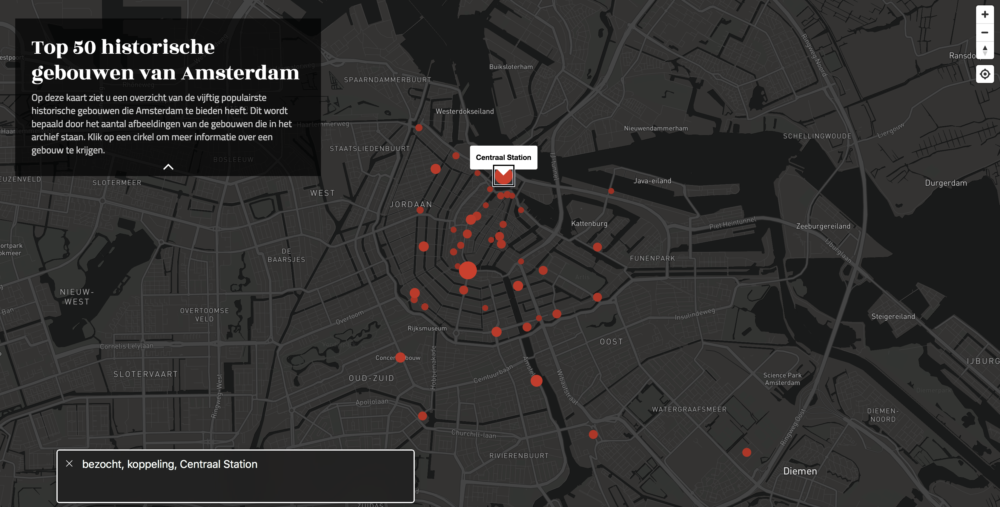

# Opdracht 1.2 - Fork je OBA


Mijn OBA applicatie bevatte de top 50 populairste toeristische gebouwen van Amsterdam, met daarbij de afbeeldingen van deze gebouwen.

Link naar prototype: https://yoeripasmans.github.io/oba/public

## Progressive Enhancement issues

### 1. Afbeeldingen

Ik kwam erachter dat ik teveel afbeeldingen inlaadde, hierdoor werd de app een stuk trager. Aangezien de afbeeldingen via Javascript werden ingeladen heb ik een if else geschreven waarin maximaal 50 van alle afbeeldingen van een gebouw getoont worden. De gebruiker kan dan zelf bepalen of hij meer afbeeldingen wilt zien door op een knop te drukken.


### 2. Custom fonts

Met met custom fonts heb ik bij mijn OBA applicatie ondervonden dat ik niet genoeg fallback fonts gebruikte, dit heb ik aangepast door een font stack toe te voegen met daarin system fonts. Nu blijft de applicatie er nog redelijk uitzien als `Titillium Web` niet ingeladen kan worden.

```CSS
body {
	font-family: 'Titillium Web', -apple-system, BlinkMacSystemFont, "Segoe UI", Roboto, Helvetica, Arial, sans-serif, "Apple Color Emoji", "Segoe UI Emoji", "Segoe UI Symbol";;
}
```

Daarnaast gebruikte ik voor iconen FontAwesome dit is een icon font wat aanvoelt als een hack. Deze wil dus ook omzetten naar SVG's. Dit scheelt ook in performance, omdat zo niet voor een paar iconen een hele style stylesheet en fonts hoeven worden ingeladen.

Van:
```HTML
<i class="fa fa-chevron-down"></i>
```
Naar:
```HTML
<svg xmlns="http://www.w3.org/2000/svg" class="fa-chevron-down" width="284.929" height="284.929" viewbox="0 0 284.929 284.929"><path d="M282.082 76.511l-14.274-14.273c-1.902-1.906-4.093-2.856-6.57-2.856-2.471 0-4.661.95-6.563 2.856L142.466 174.441 30.262 62.241c-1.903-1.906-4.093-2.856-6.567-2.856-2.475 0-4.665.95-6.567 2.856L2.856 76.515C.95 78.417 0 80.607 0 83.082c0 2.473.953 4.663 2.856 6.565l133.043 133.046c1.902 1.903 4.093 2.854 6.567 2.854s4.661-.951 6.562-2.854L282.082 89.647c1.902-1.903 2.847-4.093 2.847-6.565 0-2.475-.945-4.665-2.847-6.571z"/></svg>
```

### 3. Javascript(Volledig)

Het probleem wat ik meteen ondervond is dat als er geen javascript aanwezig is er geen kaart getoont wordt. Dit komt door dat Mapbox javascript nodig heeft om de kaart te renderen ook wordt de data via javascript ingeladen. Hier kan ik dus niks aan veranderen. Wel bevatte mijn app een accordion met een introductie over applicatie. De content werd daarin zonder javascript niet weergegeven. Dit kwam doordat ik het element met CSS standaard verborg. Dit heb opgelost door een class met javascript toe te voegen om deze alleen te sluiten als er javascript aanwezig is.

### 4. Kleur

Voor de kleuren heb ik een analyse gedaan met de `Chrome` extensie `Color Contrast Analyser`. Hieruit kreeg ik afbeelding waarin de contrasten goed te zien waren.


De contrasten van de tekst bleken in orde te zijn. Het enige wat ik verandert heb is een lichte opacity aan de cirkels gegeven om het verschil tussen de elementen beter te kunnen inzien.

### 5. Breedband internet
De performance heb ik verbeterd door het optimalizeren en minifien van de css en javascript files. Doordat de bestandgrootte van deze files kleiner werd kan de site sneller geladen worden. Ook wil ik de statische bestanden cachen zodat ze niet nog een keer door de browser gedownload hoeven worden.


### 6. Cookies
Voor mijn applicatie heb ik nog geen gebruik gemaakt van cookies. Deze hoefde dus ook niet geoptimaliseerd te worden.

### 7. Local storage
Ik werkte eerst alleen met local storage om data op te slaan. Als dit het niet deed werkte de app niet meer. Ik heb daarom een if else om de functie van het data ophalen heen gezet die checkt of de data al in localStorage bevindt. Als dit zo is haalt hij daar de data uit, maar als dit niet zo is (ook als localStorage niet werkt) haalt hij de data op en slaat dit op in een Javascript object.

### 8. Muis/trackpad
De applicatie was eerst alleen te gebruiken met muis/trackpad, omdat de elemnten die klikbaar waren div's waren. Dit heb ik veranderd naar linkjes waarmee je met je toetstenbord doorheen kan navigeren. Daarnaast heb ik op alle links focus styles toegevoegd om duidelijk te maken waar de gebruiker zich bevindt.


## To do

Als ik meer tijd zou hebben dan zou ik de problemen met het gebruik van een offline map oplossen. Zodat de gebruiker alsnog de applicatie zonder netwerk/javascript kan gebruiken. Ook zou ik het probleem met navigeren tussen afbeeldingen verbeteren zodat je de applicatie volledig met je toetstenbord kan bedienen.

## Screenreader

Voor de screenreader heb ik `voiceOver` gebruikt op mijn mac. Hierdoor kwam ik erachter dat ik bij de links naar de verschillende gebouwen geen tekst stond en dus niet door de screenreader uitgesproken werd. Dit ik veranderd door text in de links toe te voegen met de naam van het gebouw. Hierdoor weet de gebruiker op welk gebouw hij zich bevindt.



## Devicelab

In het device lab heb ik mijn OBA app getest en kwam er al snel achter dat deze niet overal werkte. Het grootste probleem was dat de mapbox kaart niet laadde op de oudere devices. Op de nieuwere apparaten werkte deze wel. Het probleem daarbij was alleen dat het inzoomen op de kaart niet werkte. De app was voor de rest wel bruikbaar, het navigeren van de kaart naar de detailpagina was mogelijk en werkte prima.


