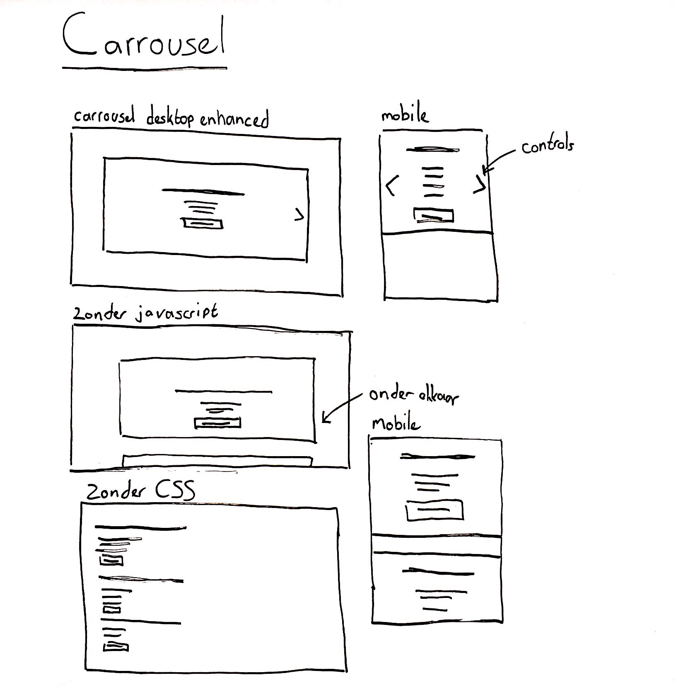

# Progressive enhanced carrousel

Een responsive uitgewerkt carousel waarin een titel en beschrijving van een artikel wordt weergegeven, daarnaast kan de gebruiker via een link naar dat artikel navigeren. Hierbij is progressive enhanced toegepast zodat je zonder CSS & Javascript alsnog de content uit het carousel kan zien.

[Link naar prototype](https://yoeripasmans.github.io/browser-technologies/opdracht2/carrousel/)

## Core functionaliteit

De belangrijkste functionaliteit van een carrousel is dat de gebruiker altijd de content moet kunnen zien op elke device ook als CSS of Javascript het niet doet. Dit heb ik gerealiseerd door eerst een basis structuur op te zetten in HTMl. Dit werkt namelijk altijd. Hierna voeg ik met Javascript een class toe aan de carrousel als javascript alle functionaliteiten bezit die de browser ondersteund. Door deze class wordt de styling aanpgeast naar een carrousel en werkt de volledige functionaliteit. Op deze manier blijft de content ten alle tijden zichtbaar.

## Feature detection

Voor feature detection heb ik bovenin mijn javascript bestand een if else neergezet die checkt of de Javascript functionaliteiten ondersteund worden door de browser.

```javascript
if (!document.querySelector || !('classList' in document.body)) {
	return false;
}
```
Daarnaast in de CSS of display flex door de browser ondersteund wordt:

```CSS
@supports (display: flex) {
    .active li {
        display: flex;
        flex-direction: column;
        justify-content: center;
		align-items: center;
    }
}
```
Als dit niet het geval is wordt er een fallback gebruikt wat er iets minder mooi uitziet maar wel werkt.:

```CSS
.active li {
    width: 100%;
    height: 100%;
	padding: 3em;
    display: inline;
    margin: auto;
	color: #fff;
}
```

## Schetsen



## Browser compatibiliteit

### Javascript
- e.preventDefault() wordt door alle browsers ondersteund alleen internet explorer t/m 9.
- document.querySelector wordt door alle browsers ondersteund alleen internet explorer t/m 9.
- classList.add & classList.remove wordt door alle browsers ondersteund alleen internet explorer t/m 9.
- addEventListener niet gesupport op IE 8 en Opera 6.0 and eerdere versies.

## CSS
- CSS3 2D Transforms wordt alleen niet op Opera Mini ondersteund
- View width & view height units worden niet ondersteund op opera Mini en deels op Internet explorer (Werkt wel door fallback naar EM)

## Bronnen

- Progressive enhancement carrousel
[https://github.com/codepo8/simple-carousel/blob/master/carousel-progressive-enhancement.html](https://github.com/codepo8/simple-carousel/blob/master/carousel-progressive-enhancement.html)

- CSS @support functionaliteit
[https://developer.mozilla.org/en-US/docs/Web/CSS/@supports](https://developer.mozilla.org/en-US/docs/Web/CSS/@supports)

- Support van features in het algemeen
[https://caniuse.com/](https://caniuse.com/)

- Javascript progressive enhancement
[https://alistapart.com/article/progressiveenhancementwithjavascript](https://alistapart.com/article/progressiveenhancementwithjavascript)
