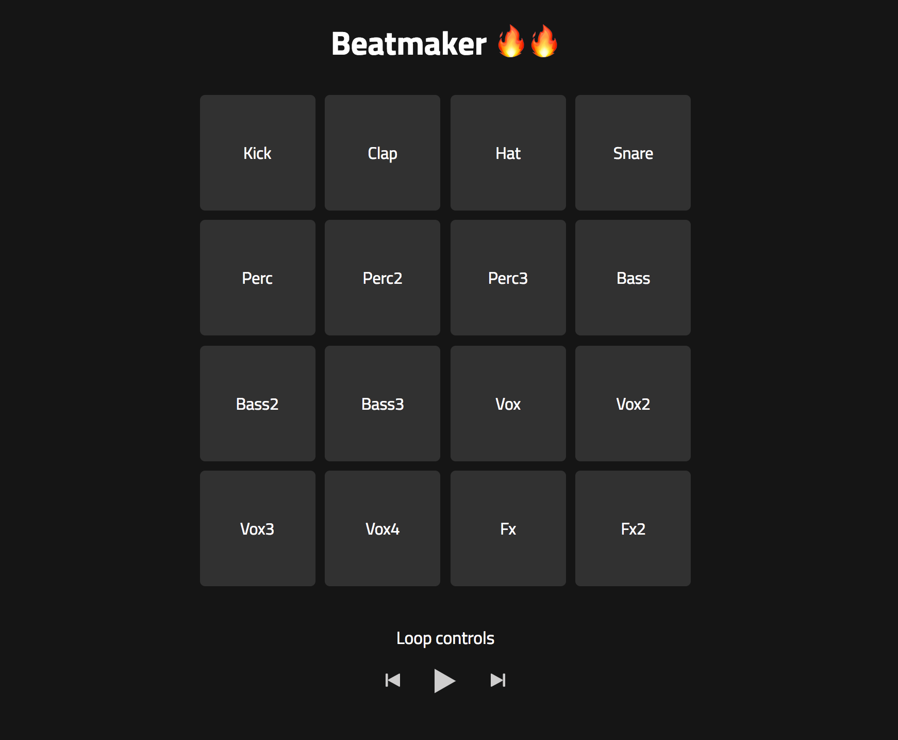

# Progressive enhanched beatmaker



Een uitgewerkte demo waarbij je met verschillende geluiden een beat kan maken. Dit kan met de muis of toetsenbord gedaan worden. Daarnaast kan de gebruiker in de achtergrond nog een geluid laten afspelen om daarbij een beat te kunnen maken.

[Link naar demo](https://yoeripasmans.github.io/browser-technologies/opdracht3/src/)

## Core functionaliteit

De belangrijkste functionaliteit van de beatmaker is dat de gebruiker altijd geluid moet kunnen afspelen op elk device ook als CSS of Javascript het niet doet. Dit heb ik gerealiseerd door eerst een basis structuur met audio elementen op te zetten in de HTMl. Dit werkt namelijk altijd. Hierna voeg ik als de browser het ondersteund met Javascript de functionaliteiten van de `Web Audio API` toe en verberg ik alle audio elementen. Op deze manier blijft de audio ten alle tijden bruikbaar.

## Feature detection

Voor feature detection heb ik bovenin mijn javascript bestand een if else neergezet die checkt of de Javascript functionaliteiten die ik in mijn code gebruik ondersteund worden door de browser. Hierna wordt er gekeken of de `Web Audio API` ondersteund wordt.

```javascript
if (document.querySelector || ('classList' in document.body)) {
	try {
		// Fix up for prefixing
		window.AudioContext = window.AudioContext || window.webkitAudioContext;
		context = new AudioContext();
	} catch (e) {
		alert('Web Audio API is not supported in this browser');
	}
} else {
	return false;
}
```

Daarnaast bij sommige functionaliteit uit de `Web Audio API` is er verschil tussen de methods.In nieuwere versie van de web audio api is `noteOn()` hernoemd naar `start()`. Safari gebruikt nog de oudere variant terwijl chrome de nieuwste gebruikt. Om alles te kunnen supporten heb ik hiervoor ook een feature detection geschreven die checkt wat ondersteund wordt.

```javascript
if (!this.source.start) {
	this.source.noteOn(0);
} else {
	this.source.start(0);
}
```

Ten slotte kijk ik in de CSS met `@support` of `display: flex;` door de browser ondersteund wordt:

```CSS
@supports (display: flex) {
    .audio-control-buttons {
        display: flex;
        justify-content: center;
		align-items: center;
    }
}
```
Als dit niet het geval is wordt er een fallback gebruikt wat er iets minder mooi uitziet maar wel werkt:

```CSS
.audio-buttons {
    max-width: 30.4em;
    margin: auto;
}
```

## Browser compatibiliteit

### Javascript
- e.preventDefault() wordt door alle browsers ondersteund alleen internet explorer t/m 9 geld hetzelfde voor addEventListener (Wordt gecheckt aan het begin van het script.).
- document.querySelector wordt door alle browsers ondersteund alleen internet explorer t/m 9.
- classList.add & classList.remove wordt door alle browsers ondersteund alleen internet explorer t/m 9.
- addEventListener niet gesupport op IE 8 en Opera 6.0 and eerdere versies.

## CSS
- CSS3 2D Transforms wordt alleen niet op Opera Mini ondersteund
- EM waardes ondersteund vanaf IE10, daarom een fallback geschreven met pixels.
- Display flex ondersteund vanaf IE10, feature detection geschreven met fallback naar basis CSS.

## Audio
Wav wordt door alle browsers behalve internet explorer ondersteund. Door te testen heb ik ondervonden dat deze op internet explorer automatisch worden verborgen en worden gezien als een ongeldige bron. Als ik meer tijd zou hebben dan zou ik voor alle geluidbestanden ook een fallback maken door deze om te zetten naar mp3. Dit wordt namelijk wel op elke browser ondersteund en op IE9 en hoger.

## Accessibility

Door van te voren na te denken over accessibility heb ik voor alle interactieve elementen buttons gebruikt. Zo kan de applicatie gemakkelijk zonder muis/trackpad bestuurd worden. Daarnaast rekening gehouden met contrast en regel afstand om zo mijn app toegangkelijker te maken.

## Bronnen

- CSS @support functionaliteit
[https://developer.mozilla.org/en-US/docs/Web/CSS/@supports](https://developer.mozilla.org/en-US/docs/Web/CSS/@supports)

- Support van features in het algemeen
[https://caniuse.com/](https://caniuse.com/)

- Javascript progressive enhancement
[https://alistapart.com/article/progressiveenhancementwithjavascript](https://alistapart.com/article/progressiveenhancementwithjavascript)
